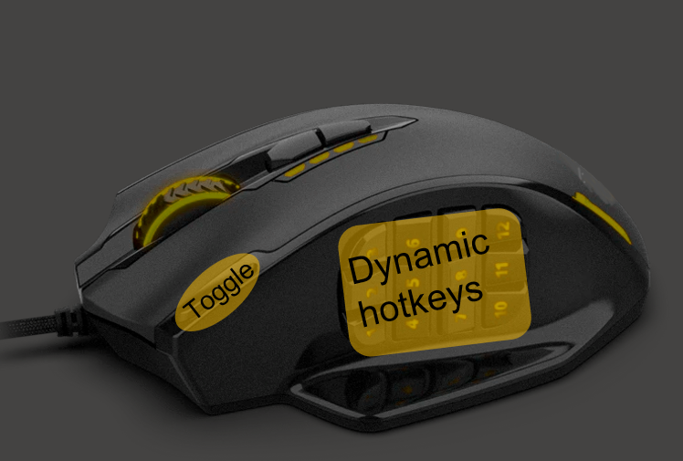
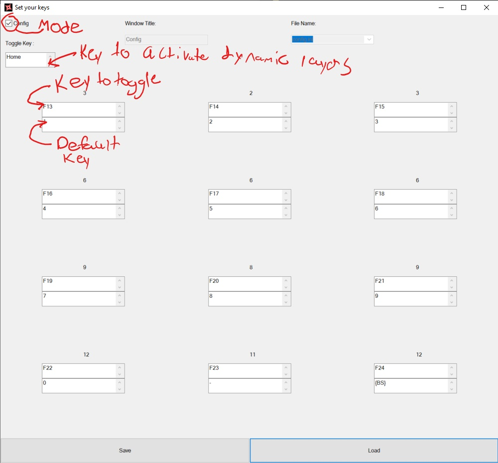
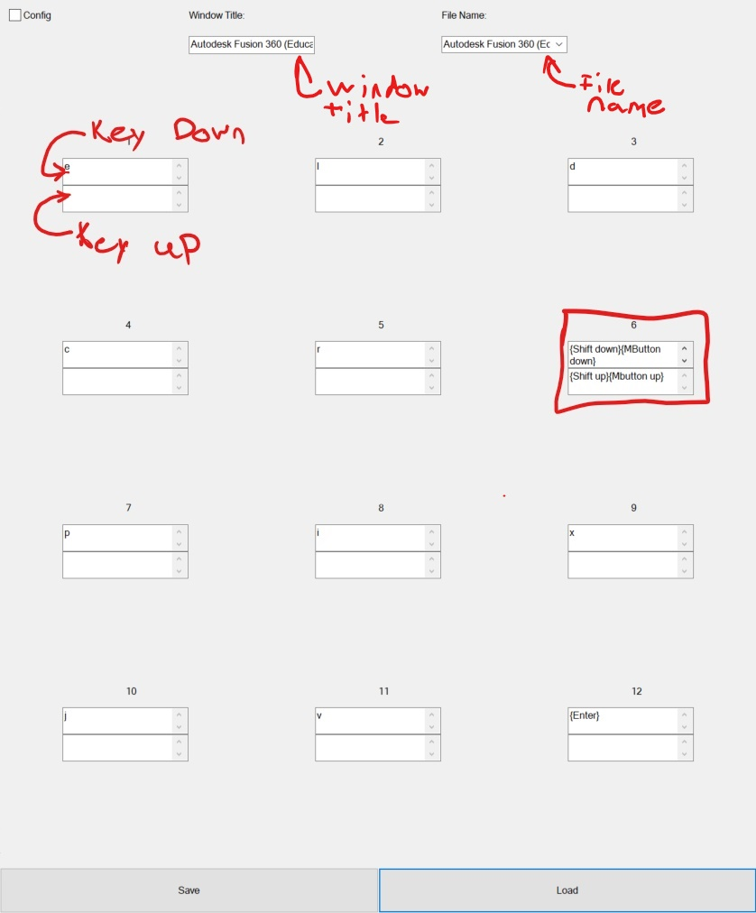
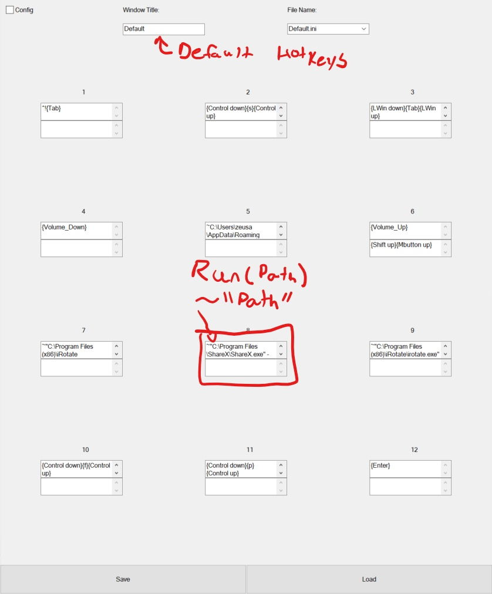

# togle-script

## What is this script
This application uses ahk to implement dynamic keyboard layers. I call them dynamic keyboard layers because using this script you configure specific keys to be remapped based on the application you're using on your computer. An example of this is having F14 mapped to change tabs in Chrome and FireFox but mapped to QuickFix in VScode on your dynamic layer. You activate these dynamic layers by holding a toggle key. 

It was built for use with an mmo gaming mouse using the "fire" key as the toggle key with the side buttons mapped to the toggle keys.
Like the image below. 

## Configuration
The script is completely configurable. Everything is stored in config files in the hotkeys folder. These configs can be set using hotkeysetter.exe or AHK. I can walk you through the GUI now.

The GUI has 2 modes toggled by the checkbox in thew upper left of the GUI. In both modes you can load configs with the load button and save configs with the save button.

### Config mode
Config mode for setting your Toggle-key and Dynamic hotkeys as well as their defaults like below. You use the top box to input the key that should be toggled while you use the other box to set what this key should send by default.

### Keymap Mode
The other mode is used more regularly It allows you to set hotkeys for a specific application. You use the top box to input the key that should be sent when the corresponding toggle key is pressed down while you use the other box to set what should be done when the key is released. Being able to send events on key presses and key releases lets you do things like press and hold a key (See index 6 in the image below for an example of this). 

### Wild cards and special Cases
There are a few special cases when configuring your keymaps. Setting you window tittle to "Default" lets you set your hotkeys to be used in applications without their own keymap. You can also use a "~" modifier to run a program from the command line. To do this enter ~"\<path to executable\>". You can also include command line arguments. See the image below for an example. This modifier translates directly to the AHK run command so see that documentation for more information. 

## Other Notes
Taping the toggle key is currently set to send a period this is hard coded but if requested can be changed pretty easily. Tapping and holding the toggle key without pressing a hotkey runs the tilling manager described below. You can also peek at window titles by holding F3 see the status of the script by double tapping F3 and suspend/enable the script by triple tapping F3. You can also set hotkeys for websites by checking their names with F3 and inserting what's befor the "-" as the window title.

# Tiling manager

## Use
This tilling manager is very similar to winDivy. The program in designed to be run on a keypress. When the program starts a black box appears, this is one corner of the area that the application will fill. Left clicking and holding locks this in place and allows you to select the other corner of the area for your application to fill releasing left click resizes the window and closes the application. Basically you click and drag to select a target area. 

## Secondary mode
Right clicking with the script running brings up a list of all the applications currently running and allows you to repetitively resize windows. by selecting them from teh dropdown then resizing normally. Left clicking away from the list or hitting escape closes the script.
