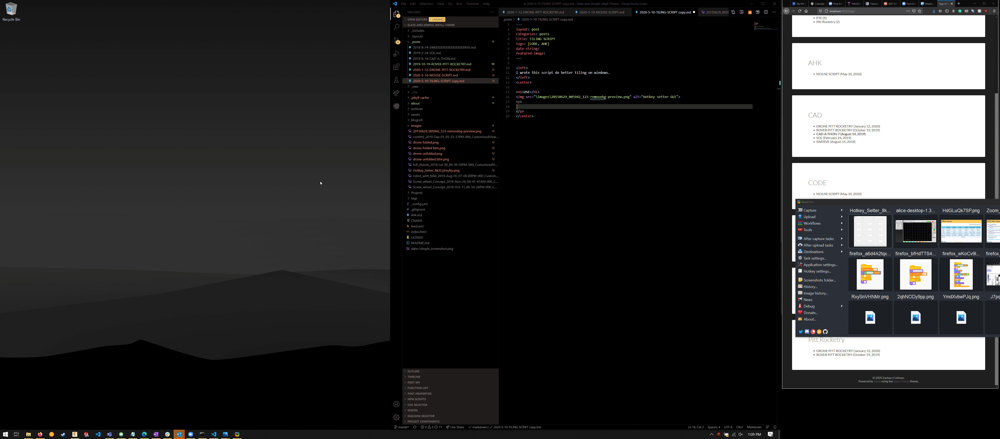

# toggle-script

## What is this script
This application uses ahk to implement dynamic keyboard layers. I call them dynamic keyboard layers because using this script you configure specific keys to be remapped based on the application you're using on your computer. An example of this is having F14 mapped to change tabs in Chrome and FireFox but mapped to QuickFix in VScode on your dynamic layer. You activate these dynamic layers by holding a toggle key. 

It was built for use with an mmo gaming mouse using the "fire" key as the toggle key with the side buttons mapped to the toggle keys.
Like the image below. 

## Configuration
The script is completely configurable. Everything is stored in config files in the hotkeys folder. These configs can be set using hotkeysetter.exe or AHK. I can walk you through the GUI now.

The GUI has 2 modes toggled by the checkbox in thew upper left of the GUI. In both modes you can load configs with the load button and save configs with the save button.

### Config mode
Config mode for setting your Toggle-key and Dynamic hotkeys as well as their defaults like below. You use the top box to input the key that should be toggled while you use the other box to set what this key should send by default.

### Keymap Mode
The other mode is used more regularly It allows you to set hotkeys for a specific application. You use the top box to input the key that should be sent when the corresponding toggle key is pressed down while you use the other box to set what should be done when the key is released. Being able to send events on key presses and key releases lets you do things like press and hold a key (See index 6 in the image below for an example of this). 

### Wild cards and special Cases
There are a few special cases when configuring your keymaps. Setting you window tittle to "Default" lets you set your hotkeys to be used in applications without their own keymap. You can also use a "~" modifier to run a program from the command line. To do this enter ~"\<path to executable\>". You can also include command line arguments. See the image below for an example. This modifier translates directly to the AHK run command so see that documentation for more information. 

By default pressing the toggle key is brings up a window like this  
  

You can change where the keys go with the [layout](#layout--path) for a keyboard like the ergodex this would look like  
  

Right clicking on a key allows you to edit the json associated with that key. You can then click escape to discard the changes or ctrl+s to save the changes.   
 
# Configuration

# Tiling manager

## Use
This tilling manager is very similar to winDivy. The program in designed to be run on a keypress. When the program starts a black box appears, this is one corner of the area that the application will fill. Left clicking and holding <\b>locks this in place<\b> and allows you to select the other corner of the area for your application to fill releasing left click resizes the window and closes the application. Basically you click and drag to select a target area. 

The attributes in config.json are as follows:

### Keys : list[Key]
This is a list of all the keys to be re-mapped. The order of the list should match the order of the [hks](#hks--listaction--listlistaction) Each key has the following attributes.  

--- Start Key obj attributes ---
#### remap : str
This is the key to re-map.

#### baseLayer : [action](#actions--obj)
This is an [action](#actions--obj) to take when the key is pressed without the toggle key.

Example :

    "keys":[
        {
            "remap": "foo",   
            "baseLayer" : {  
                "press" : "bar"  
            }  
        },
        ...
    ],
This makes it so that when 'foo' is pressed 'bar' is sent.  

--- End key obj attributes---

### toggleKey : str
This is the key that activates the GUI and the application specific keymap.

### doRemapping : bool
Should the script re-map the keys listed in keys based on an application. The toggle key is still modified.

Default - true

### drawGUI : bool
Should the script show use resources to show a GUI when the toggle key is held. 

Default - true

### layout : path
This is the path the keyboard layout json. This does not support rotation. The layout can be generated/downloaded from [here](http://www.keyboard-layout-editor.com/#/) (This is not my work but it's cool so I used the same format). The legends in this layout should match the [remap](#remap--str) name.

Default - "Layouts/keyboard-layout-4.json"

### ToggleActions : obj
It would be a shame to waste a key. ToggleActions allows actions to be configured for when the toggle key is pressed without pressing an action key.  

--- Start ToggleActions attributes  ---
#### tap : [action](#actions--obj)
This is the action to take when the toggle key is tapped and released without pressing another key.

#### tap : [action](#actions--obj)
This is the action to take when the toggle key is held and then released without pressing another key.  
   
--- End ToggleActions attributes  --- 

### Funcs : List[obj]

These are the prefixes for use in [actions](#actions--obj) using these prefixes actions can invoke pyhton functions defined in the customFuncs module. each object should contain :  

--- start function attributes ---
#### prefix : char
This is the prefix for the function action beginning with this character will be mapped to the ... 

#### function : str
This is the name of the python function to be called. The argument to this function is whatever follows the prefix in the [command](#command--str)

--- end function attributes ---

## Application specific configs

### appName : str

This is the name of the application that this config applies to. This takes priority over the [regex](#regex--str). 

### regex : str
Regex to match with the full window title.

### priority : int
This is the priority for the regex. This is the priority for the regex match. If multiple regex patterns match the map with the higher priority will be applied.  

### hks : list[[action](#actions--obj)] | list[list[[action](#actions--obj)]]
This is a list of actions to map to the keys to the keys specified in [Keys](#keys--listkey), this is done based on index. If a list of actions is used instead of an action those actions will be added to layers. The default layer is the first entry. 

You can create an action to set/change the current layer by invoking the [setLayer](#setLayer) [function](#Function--obj).

default : Use the actions in the map with the name "default"

## Common configs

## Actions : obj 
Actions are the object that define what a key will do. Actions have the following attributes.

--- Start actions attributes  --- 

### Press : [Function](#Function--obj) | [command](#command--str)
This is what happens when the key is pressed. It can be either a function or a command.

default : Nothing

### Rel : [Function](#Function--obj) | [command](#command--str)
This is what happens when the key is released. It can be either a function or a command.

default : Nothing

### icon path
This is an image to be displayed on the GUI when this layer is active. This will be displayed if it present otherwise use the description.

default : No image use the description

### description : str
This is a description to be displayed on the GUI when this layer is active. This will only be displayed if no icon is specified.

default : Raw json for the actions

--- End actions attributes  --- 

Example : 

    {
        "press": "{Shift down}",
        "rel": "{Shift up}",
        "description": "rotate camera"
    }

This action presses and holds shift when a key is pressed and releases it when the key is released. 

### Function : obj

This is a function call to a python function with named arguments.

Example :

    {
    "function" : "foo",
    "args" : {
        "type" :"set",
        "val": 2
        }
    }

is equivalent to a call foo(type="set", val=2)

### Command : str
Strings are just sent as written but commands are wrapped in curly braces `{}` 
A command to send when it is parsed using the regex :  

`(?<!//){(?P<cmd>.*?)((?P<down> down)|(?P<up> up))?(?<!//)}|(?P<str>[^/{]+)`

For each match in string

- If the string group matches send that string. 
- If the cmd group matches check for a prefix from [Funcs](#funcs--listobj) if it is present strip it and pass the rest of the command to the function as a string.  
    - If the down group matches press and hold the specified key until it is released with an up group  
    - If the up group matches release the specified key

Example :

    {Shift down}s

This command presses and holds shift and taps s.

# My use case
I use this software in conjunction with a MMO gaming mouse and not a keyboard. That's why I have my keymaps set up the way I do.

# WIP 

- Replace tkinter with a more modern GUI framework
  - Create the windowed glass effect more seamlessly
- Validate jsons before parsing them
- Add support for non-windows oses 
- Get closer to the kernel and communicate directly with usb devices
